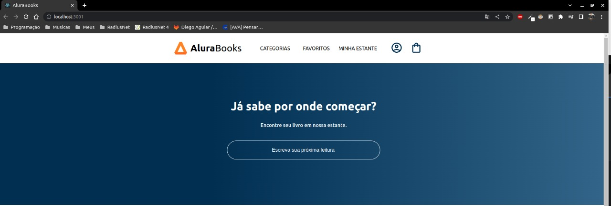
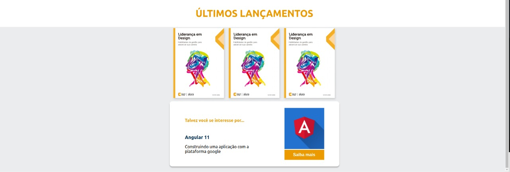

# Estudos ReactJs

> Projeto construído para estudos 🚀

**Construindo Projeto Alura Books, conceitos e bases de front-end REACT**

- Baixe o projeto

- Execute $ npm install dentro do diretório do projeto para baixar a pasta de *node_modules*

- Execute $ npm start após baixar a pasta *node_modules*

## Descrição

- Conceito e criação de componentes
- Estilização utilizando Styled Components
- Estados
- Props

## Tecnologias

## Contato

:email: gsjoaopedro7@gmail.com

:telephone_receiver: (19) 99744-9537
